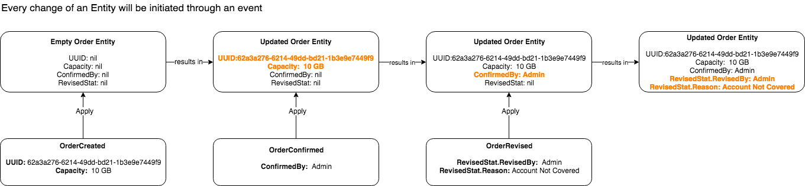

# ixstorage Eventsourcing Quick Start Guide

The communication between ixstorage services is initiated through event sourcing.

## What is Event Sourcing?

The general idea behind eventsourcing is to store the state of an application as sequence of events that occured over time rather than just persisting the current state of an entity. This makes it possible to perceive what kind of events lead to the current state of an entity at any given point in time which in turn facilitates easy traceability and debugability. Events are usually stored in an event log in a database.

Eventsourcing also allows to make time series analysis by replaying events over a specific period of time. This gives an overview over the historical development of an entitie's state which would not be possible if only the recent state of an entity was persisted. Since over time the number of events that need to be replayed might drastically increase there needs to be a way to improve the overall performance of an event sourced system.

This is where snapshots come into play:

 Events are immutable entries in the event log and will never change once persisted. Also,an event will always be appended to the end of the event log. This allows for easy reproduction of the event log by just replaying the log from a given point in time to eiter a specific point in time or to the end of the event log.

There are a lot of great articles and blog posts which explain the principle in more detail.

- [Event Souring (by Martin Fowler)](https://martinfowler.com/eaaDev/EventSourcing.html)
- [Turning the database inside out](https://www.confluent.io/blog/turning-the-database-inside-out-with-apache-samza/)

## Why is Event Sourcing useful?

For communicating between ixstorage services we decided to implement an event sourced system which enables [CQRS](https://martinfowler.com/bliki/CQRS.html) and with that provides a good amount of decoupling between our services. Also, we want to ensure that each event occuring on our aggregates can be reproduced at a later point in time if necessary which might help us for data analysis and better debugging.

## Dataflow explained

In order to keep things simple the following illustration will demonstrate how eventsourcing works based upon a very simplified order processing system.

## Example

Look at [Sample Eventsourcing App](../../pkg/apps/ixservice/examples/eventsourcing/README.md) which shows a running example application demonstrating the above mentioned principles.